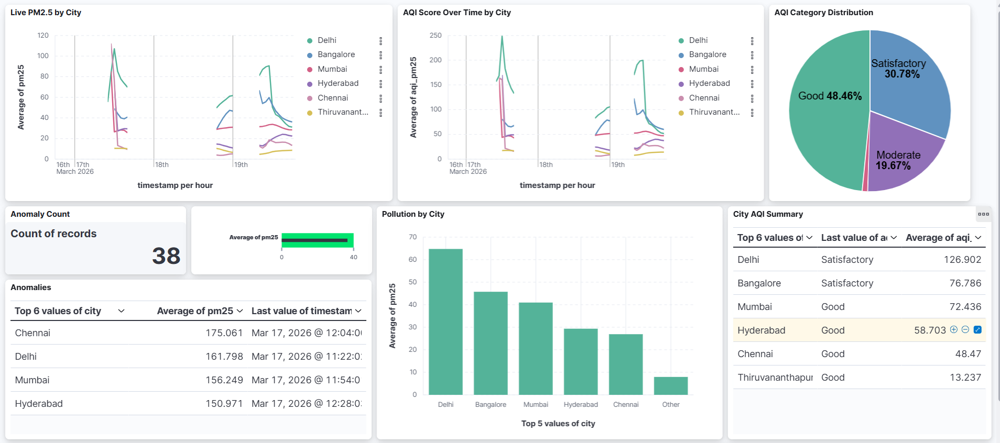
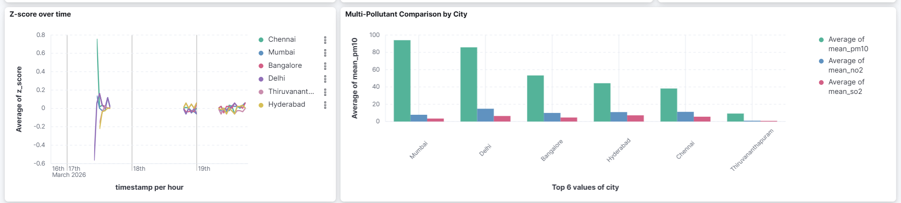

# 🌫️ Real-Time AQI Anomaly Detection — India

This project builds a real-time pipeline that monitors air quality across 6 major Indian cities, calculates AQI using India's official CPCB formula, and automatically flags anomalies when pollution spikes unusually.

Built as a Big Data Analytics project using Kafka, Spark Structured Streaming, Elasticsearch, and Kibana.

---

## 🏙️ Cities Monitored

Delhi · Mumbai · Bangalore · Chennai · Hyderabad · Thiruvananthapuram

---

## 🏗️ How It Works

```
Kaggle Historical Data (2015–2023)  +  OpenWeatherMap Live API
                    │                           │
                    └──────────┬────────────────┘
                               ▼
                          producer.py
                    (Phase 1: historical replay)
                    (Phase 2: live API every 5 min)
                               │
                               ▼
                    Kafka — air_quality_raw
                               │
                               ▼
                    stream_consumer.py (PySpark)
                    • 10-min sliding windows
                    • Z-score anomaly detection
                    • CPCB AQI calculation
                               │
                               ▼
                       Elasticsearch
                    (air_quality_index)
                               │
                               ▼
                    Kibana Dashboard
                (auto-refreshes every 5 sec)
```

The pipeline runs in two phases. First it replays 8 years of historical AQI data from Kaggle — this is important because it gives Spark enough readings to calculate meaningful baselines (mean and std deviation) per city before live data even arrives. Then it switches to polling the OpenWeatherMap API every 5 minutes for real readings.

---

## 📊 Dashboard

The Kibana dashboard shows the last 6 hours of data and auto-refreshes every 5 seconds. Here's what's on it:

- **Live PM2.5 by City** — real-time pollution trends for all 6 cities
- **AQI Score Over Time** — CPCB AQI score trends so you can see if things are getting worse
- **AQI Category Distribution** — pie chart showing how often each category (Good/Satisfactory/Moderate etc.) appears
- **Pollution by City** — bar chart ranking cities by average PM2.5
- **Multi-Pollutant Comparison** — compares PM10, NO2, and SO2 per city side by side
- **City AQI Summary** — table with each city's current AQI category and score
- **Z-score Over Time** — the anomaly signal; spikes above 2.0 mean something unusual is happening
- **Anomaly Count** — total number of anomalies detected
- **Anomalies Table** — which cities are currently flagged
- **Pollution Severity Gauge** — overall average PM2.5 with Good/Moderate/Dangerous color bands



---

## 🔬 Anomaly Detection

### Z-Score Method
For each city in each 10-minute window:

```
z = (current_pm25 - mean_pm25) / std_pm25
```

If z > 2.0, the reading is more than 2 standard deviations above the window mean — that's flagged as an anomaly. This threshold is configurable in `stream_consumer.py`.

### Why historical data matters
Without historical data, Spark only has 1-2 live readings per window, which means std_dev ≈ 0 and z-score is always 0. The 13,000+ historical records from Kaggle establish a proper baseline per city so the anomaly detection actually works.

### CPCB AQI Formula
India's Central Pollution Control Board AQI scale, based on PM2.5:

| PM2.5 (µg/m³) | AQI | Category |
|---------------|-----|----------|
| 0 – 30 | 0 – 50 | Good |
| 31 – 60 | 51 – 100 | Satisfactory |
| 61 – 90 | 101 – 200 | Moderate |
| 91 – 120 | 201 – 300 | Poor |
| 121 – 250 | 301 – 400 | Very Poor |
| 250+ | 400+ | Severe |

PM2.5 is used as the primary indicator because it's the dominant pollutant driving AQI in Indian cities and is the key component in CPCB calculations.

---

## 📦 Dataset

**Kaggle: [India City AQI Dataset 2015–2023](https://www.kaggle.com/datasets/tushardobal/india-city-air-quality-index-dataset-20152023)**

- File: `india_city_aqi_2015_2023.csv`
- 8 years of historical AQI data across Indian cities
- Contains PM2.5, PM10, NO2, SO2, O3, CO readings
- Used in Phase 1 to seed the Kafka topic and establish baselines

Download the dataset from Kaggle and preprocess it into `producer/historical_data.json` before running.

---

## 🛠️ Tech Stack

| What | Tool |
|------|------|
| Message broker | Apache Kafka (Confluent 7.5.0) |
| Stream processing | Apache Spark 3.x (PySpark) |
| Storage + search | Elasticsearch 8.12.0 |
| Visualization | Kibana 8.12.0 |
| Containers | Docker + Docker Compose |
| Live data | OpenWeatherMap Air Pollution API |
| Historical data | Kaggle (2015–2023) |
| Language | Python 3.x |

---

## ⚙️ Setup

### What you need
- Docker Desktop
- Python 3.8+
- OpenWeatherMap API key (free at openweathermap.org)
- The Kaggle dataset downloaded and preprocessed into `producer/historical_data.json`

### 1. Clone the repo
```bash
git clone https://github.com/neeha-praveen/Air-Quality-Anomaly.git
cd Air-Quality-Anomaly
```

### 2. Create your `.env` file
```env
API_KEY=your_openweathermap_api_key_here
```

### 3. Download the JAR dependencies
The JARs aren't committed to this repo because of file size. Download them and place in the `jars/` folder:
 
| JAR | Download From |
|-----|---------------|
| `spark-sql-kafka-0-10_2.12-3.5.0.jar` | [Maven](https://mvnrepository.com/artifact/org.apache.spark/spark-sql-kafka-0-10) |
| `kafka-clients-3.4.1.jar` | [Maven](https://mvnrepository.com/artifact/org.apache.kafka/kafka-clients) |
| `spark-token-provider-kafka-0-10_2.12-3.5.0.jar` | [Maven](https://mvnrepository.com/artifact/org.apache.spark/spark-token-provider-kafka-0-10) |
| `commons-pool2-2.11.1.jar` | [Maven](https://mvnrepository.com/artifact/org.apache.commons/commons-pool2) |
| `elasticsearch-spark-30_2.12-8.12.0.jar` | [Elastic](https://www.elastic.co/guide/en/elasticsearch/hadoop/current/install.html) |

### 4. Start Docker
```bash
docker-compose up -d
```

Check everything is running:
```bash
docker ps
```
You should see `zookeeper`, `kafka`, `elasticsearch`, `kibana` all up.

### 5. Install Python packages
```bash
python -m venv venv
venv\Scripts\activate        # Windows
# source venv/bin/activate   # Mac/Linux
pip install -r requirements.txt
```

### 6. Start the producer
```bash
python producer/producer.py
```

Phase 1 replays all historical records first (takes a few minutes depending on the sleep interval). You'll see:
```
[HISTORICAL 1/13148] Delhi pm25=...
```
Once done it switches automatically to Phase 2 (live API).

### 7. Start the Spark consumer (new terminal)
```bash
run.bat spark/stream_consumer.py
```

You should see:
```
Index creation: 200 {"acknowledged":true,"shards_acknowledged":true}
```
That `200` confirms Elasticsearch got the correct mapping with timestamp as a date field. If you see anything other than 200, the index already exists — delete it and restart.

### 8. Open Kibana
Go to `http://localhost:5601`

Set up the data view:
- Stack Management → Data Views → Create data view
- Index pattern: `air_quality_index*`
- Timestamp field: `timestamp`
- Save

---

## 🔗 Service URLs

| Service | URL |
|---------|-----|
| Kibana | http://localhost:5601 |
| Elasticsearch | http://localhost:9200 |
| Kafka | localhost:9092 |

---

## 📝 Useful Commands

```bash
# Check if data is flowing into Elasticsearch
curl http://localhost:9200/air_quality_index/_count

# List all Kafka topics
kafka-topics --bootstrap-server localhost:9092 --list

# Peek at raw Kafka messages
kafka-console-consumer --bootstrap-server localhost:9092 --topic air_quality_raw

# Reset everything and start fresh
curl -X DELETE http://localhost:9200/air_quality_index
rmdir /s /q C:\bda_project\checkpoints\air_quality
del historical_done.txt
```

